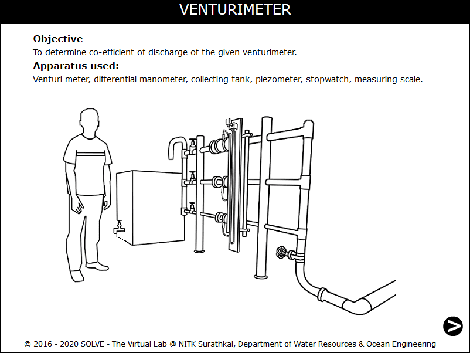
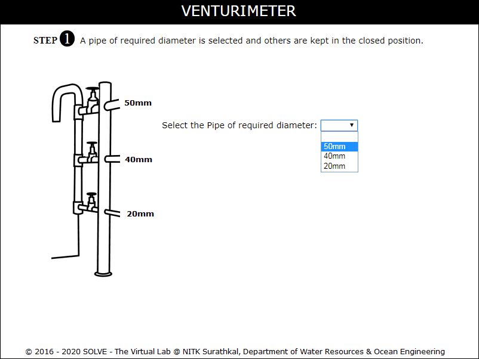
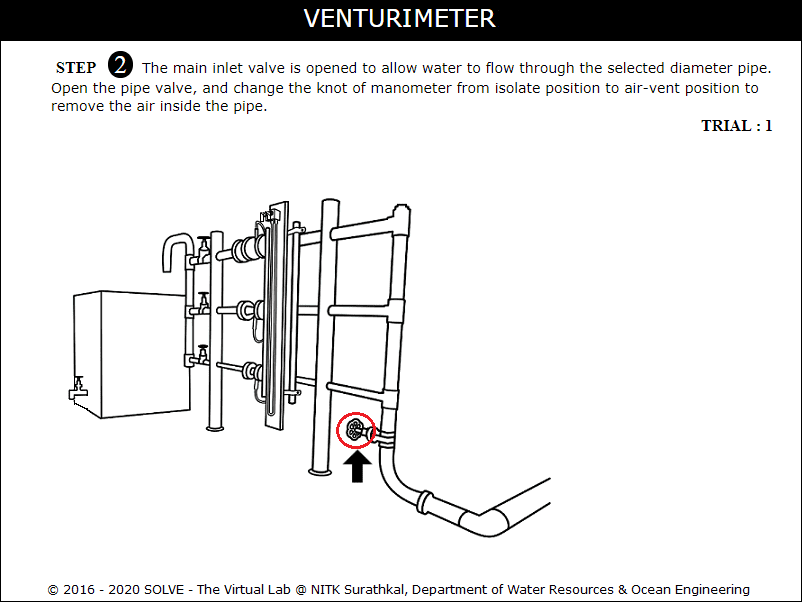
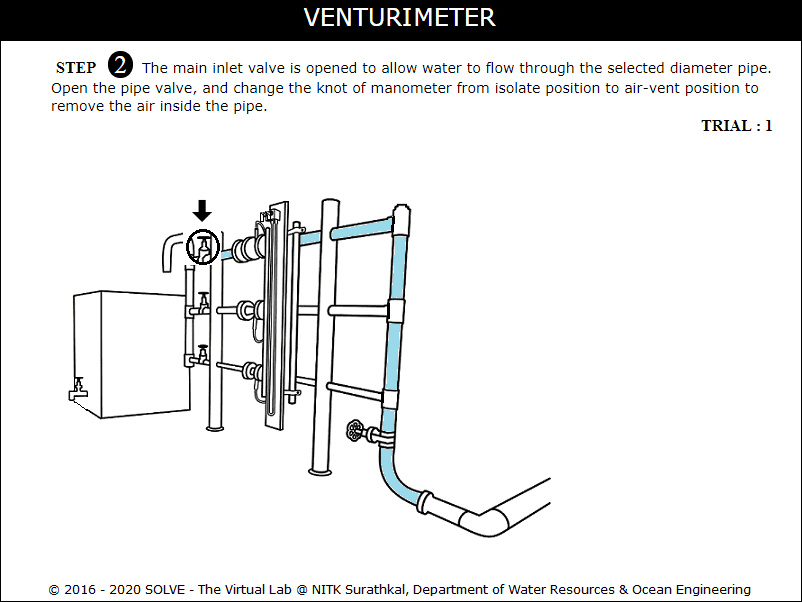
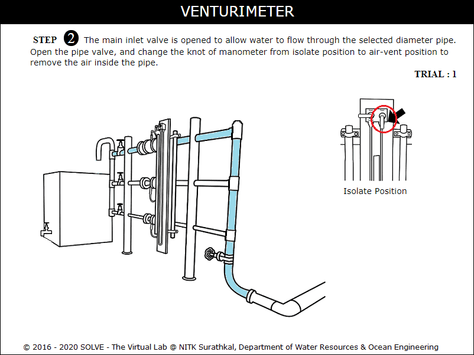
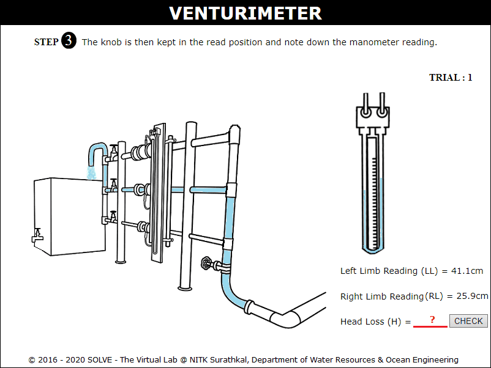
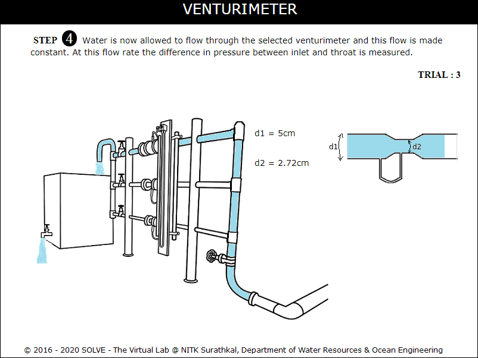
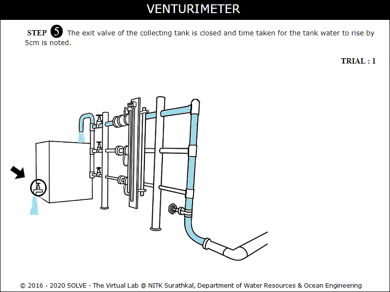
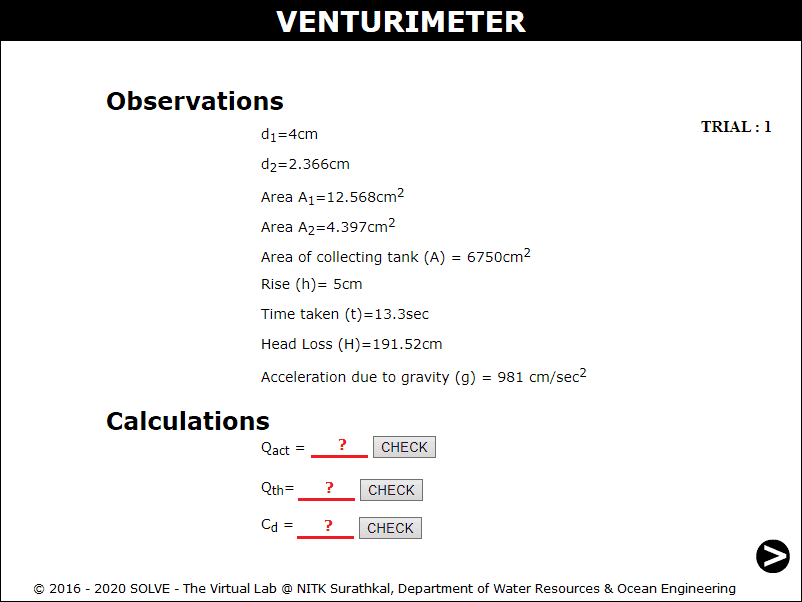

#### These procedure steps will be followed on the simulator

<ol>
<li>Open Venturimeter experiment, a window will appear as shown.</li>

<li>Select the required diameter of pipe, then click NEXT button.</li>

<li>Click on the main inlet valve to allow the flow through it.</li>

<li>Click on pipe inlet valve to allow the flow through it.</li>

<li>Click on manometer knot to change it from isolated position to air-vent position to remove air bubbles and again click to change it to read position.</li>

<li>Here the manometer reading is noted down. The calculate the value of Head Loss.</li>

<li>Click on tank outlet valve to close it to measure the discharge.</li>

<li>The observation and calculations of the trial is given here.</li>

<li>Calculate actual discharge, theoretical discharge and coefficient of discharge. Repeat the same procedure for other trials.</li>

</ol>
