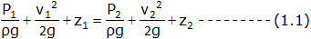

### INTRODUCTION 

Venturimeter is a flow measurement device, which is based on the principle of Bernoulli's equation. Inside the pipe pressure difference is created by reducing the cross-sectional area of the flow passage. This difference in pressure is measured with the help of manometer and helps in determining rate of fluid flow or other discharge from the pipe line. Venturimeter has a cylindrical entrance section, converging conical inlet, a cylindrical throat and a diverging recovery cone. 

#### Components of venturimeter :

<strong>a) Cylindrical entrance section: </strong>This is the section having the size of a pipe to which it is attached. The venturimeter should be proceeded by a straight pipe of not less than 5 to 10 times the pipe diameter and free from fittings, misalignment and other source of large scale turbulence.

<strong>b) Converging conical section: </strong>The converging takes place at an angle of 21±2&deg;. The velocity of fluid increases as it passes through the converging section and correspondingly the static pressure falls.

<strong>c) Throat: </strong>This is a cylindrical section of minimum area. The velocity is maximum and the pressure is minimum. The throat diameter is usually between ½ to ¼ of the inlet diameter. Length of the throat equals its diameter.

<strong>d) Diverging section: </strong>This is a section in which there is a change of stream area back to the entrance area. The recovery of kinetic energy by its conversion to pressure energy is nearly complete and so the overall pressure loss is small. To accomplish a maximum recovery of kinetic energy the diffuser section is made with an included angle of 5&deg; to 7&deg;. This angle has to be kept less so that the flowing fluid has least tendency to separate out from the boundary of the section.

#### Types of Venturi Tubes :

<ol style="list-style-type: decimal; text-align: justify;">
<li>a standard long-form or classic venturi tube </li>
<li>a modified short form where the outlet cone is shortened </li>
<li>an eccentric form to handle mixed phases or to minimize build-up of heavy materials </li>
<li>a rectangular form used in duct work</li>

</ol>

</img>

The major disadvantages of this type of flow detection are the high initial costs for installation and difficulty in installation and inspection. The Venturi effect is the reduction in fluid pressure that results when a fluid flows through a constricted section of pipe. The fluid velocity must increase through the constriction to satisfy the equation of continuity, while its pressure must decrease due to conservation of energy: the gain in kinetic energy is balanced by a drop in pressure or a pressure gradient force. An equation for the drop in pressure due to venturi effect may be derived from a combination of Bernoulli’s principle and the equation of continuity.

</img>

Let d1 = Diameter at inlet or at section 1
 

V1 = velocity of fluid at section 1
 

  

P1 = Pressure at section 1
 

and d2, V2, a2 and P2 are the corresponding values at section 2.
 

Applying Bernoulli’s equations at section 1 and section 2, we get,
 

   

Since the pipe is horizontal, so z1 = z2
 

      

     

   

Now applying continuity equation at section 1 and 2
 

   

Substituting value of v1 in equation (1.4) we get
 

                      

Where,  x = difference between the liquid column in U tube,  ρL = density of lighter liquid,  ρ = density of liquid flowing through pipe.

But, discharge through venturimeter,

Q=a2v2

         

Equation (1.5) gives the discharge under ideal conditions and is called as theoretical discharge.

Actual discharge is given by,

Actual discharge = Coefficient of venturimeter  x Theoretical discharge

  

Recovery of Pressure Drop in Orifices, Nozzles and Venturi Meters: 

The pressure drop in orifice meter and nozzles are significantly higher than the venture meters. Venturi causes less overall pressure loss in a system and thus saves energy: the overall pressure loss is generally between 5 and 20 per cent of the measured differential pressure. The venturimeter has an advantage over the orifice plate in that it does not have a sharp edge which can become rounded; however, the venturimeter is more susceptible to errors due to burrs or deposits round the downstream (throat) tapping. The lengths of straight pipe required for upstream and downstream of a venturimeter for accurate flow measurement are given in ISO 5167-1: 1991.

